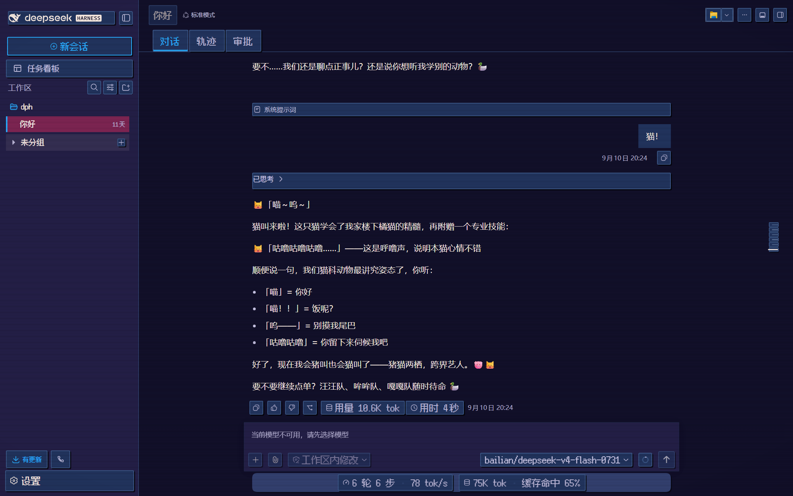
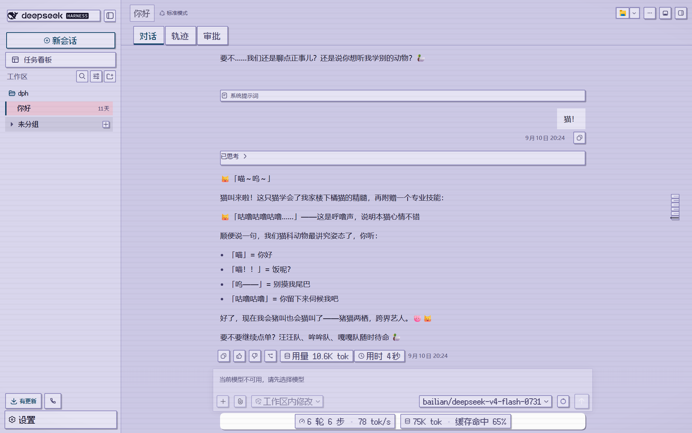
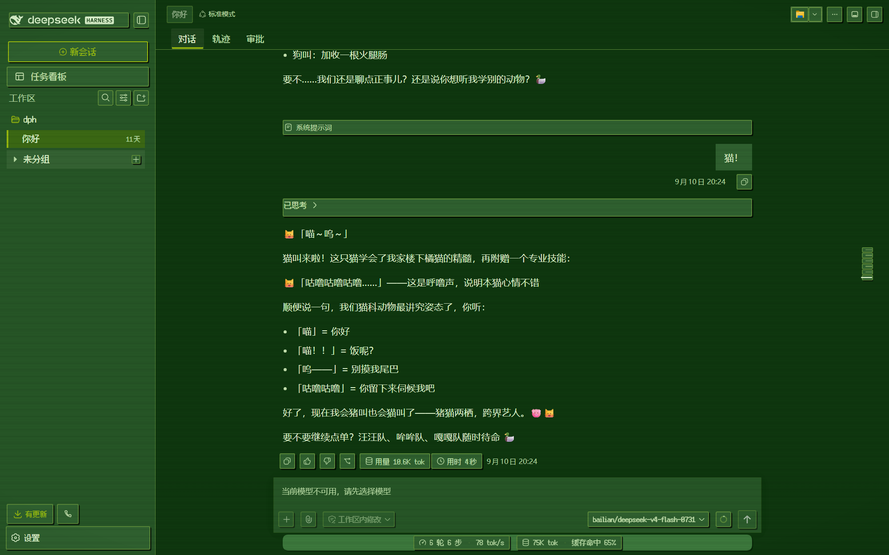
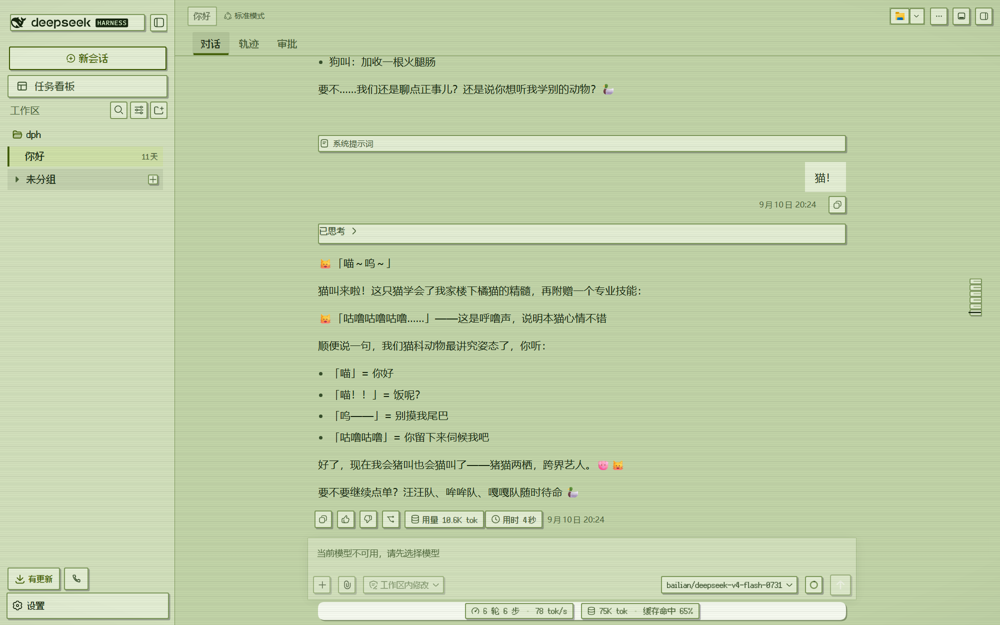
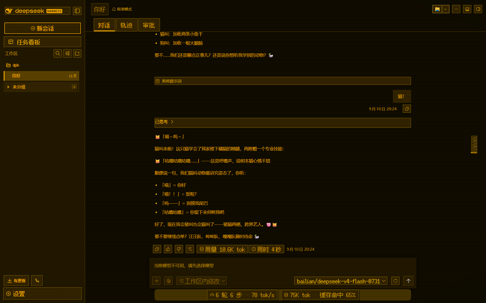
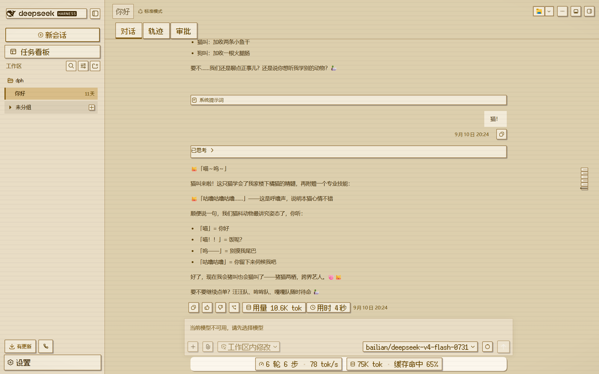

# 像素机架 · Pixel Rig

**给 DeepSeek Harness（DSH）的复古像素主题族。三套配色，明暗双系统，零 JavaScript。**

点阵字体尽量严格对齐像素栅格，控件用 2px 实描边 + 不带模糊的硬投影，按下时整体下沉 —— 是那种老式机器的手感，而不是把界面调暗了事。三套配色的取色各自来自一台真实存在过的显示设备。

---

## 三套配色

### 街机霓虹 · Arcade Neon

深蓝紫底、霓虹青强调色、珊瑚红危险色。

| 暗色 | 亮色 |
| :---: | :---: |
|  |  |

### 掌机绿 · Handheld Green

无背光掌机的四级绿，只用明度分层、不用色相。

| 暗色 | 亮色 |
| :---: | :---: |
|  |  |

### 终端琥珀 · Amber Terminal

DOS 时代的单色琥珀荧光屏，低亮度护眼。

| 暗色 | 亮色 |
| :---: | :---: |
|  |  |

---

## 这套主题做了什么

| | |
|---|---|
| **自带像素字体** | 缝合像素字体 Fusion Pixel 12px，简体覆盖 100%，随包分发、不联网 |
| **为像素字体挑过字号** | 字号不是随手定的，是按「设计档位 × 屏幕缩放比 = 整数」挑的；文档里写了你自己那块屏该怎么算 |
| **硬边与硬投影** | 控件 2px 实描边 + 2px 硬投影；按下时位移 2px、投影同时收拢 —— 纯 CSS，不用模糊 |
| **方与圆分层** | 操作控件、输入框、浮层圆角 3~4px；列表行、页签、徽章、代码块一律方角 |
| **明暗双系统** | 每套配色都有独立的亮色版本，不是把暗色简单反相 |
| **零 JavaScript** | 全部效果只用声明式 CSS，因此手工拷贝安装也能完整生效 |
| **正文保持可读** | 界面外壳与按钮用像素体，长文正文用系统可读字体 —— 像素体读长段落太累 |

---

## 安装

1. 把 `皮肤/` 下任意一套配色（例如 `pixel-handheld/`）**整个文件夹**拷进去：

   | 系统 | 目标路径 |
   |---|---|
   | Windows | `C:\Users\<你>\.dsh\skins\pixel-handheld\` |
   | macOS / Linux | `~/.dsh/skins/pixel-handheld/` |

2. **刷新页面** —— 皮肤的样式与字体是页面加载时注入的，不刷新看到的还是旧皮肤。
3. 设置 → 皮肤中心 → 找到它 → 应用。

三套可以同时装着、随时切换。详细步骤、卸载、以及想自己改配色重新构建，见 **[安装说明.md](安装说明.md)**。

---

## 想自己做一个？

这套主题的全部经验 —— 包括踩过的十个坑、像素字体的锐利条件、字号该怎么定 —— 都写在
**[主题制作与调优指南.md](主题制作与调优指南.md)**。

那份文档是**可以带着走**的：换一台机器、换一套配色、换一个想改的地方，照着流程走就行，不用重新摸索。

源码在 `源码/`：改 `src/palettes/*.json` 换配色，`node src/build.mjs` 重新构建。

---

## 许可与来源

- **皮肤代码**：MIT，见 [LICENSE](LICENSE)。
- **字体**：[缝合像素字体 Fusion Pixel Font](https://github.com/TakWolf/fusion-pixel-font) © TakWolf，**SIL Open Font License 1.1**。
  每套皮肤内已附带 `NOTICE.txt` 与 `assets/fonts/LICENSE-OFL-font.txt`，二次分发请一并保留。